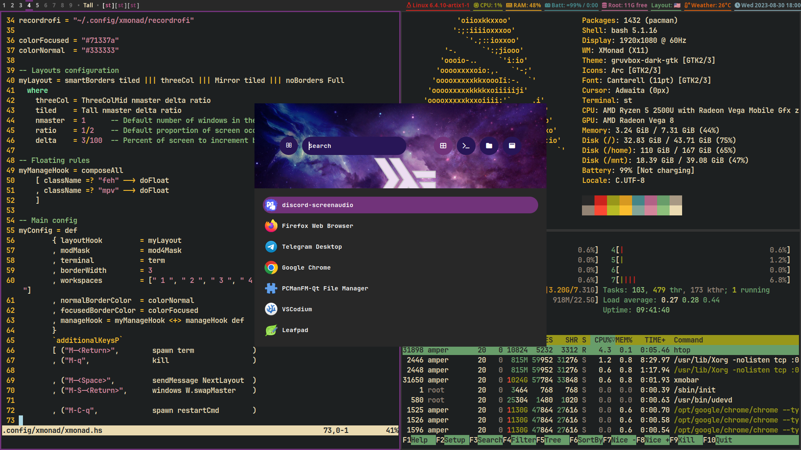

# Xmonad rice

My Xmonad configuration files.



## Dependencies
- `xmonad` (Who would have thought?)
- `rofi` Application launcher
- `dunst` Notifications
- `pulseaudio-utils` Volume control
- `flameshot` Screenshotting tool
- `JetBrains Mono Bold` Main font
- `font-awesome` v6.0.0+ 🚀


## Installation

Don't worry, this script will create reserve copy of your old configuration files for dunst, xmonad and rofi!
```bash
./install.sh
```

Execute the `update-source` script in the `~/.config/xmonad` to automatically download and compile it using `stack`. 
```bash
cd ~/.config/xmonad
./update-source
```
You can skip this step if you don't use `stack`
***
You can find the wallpaper in `~/.config/xmonad`
